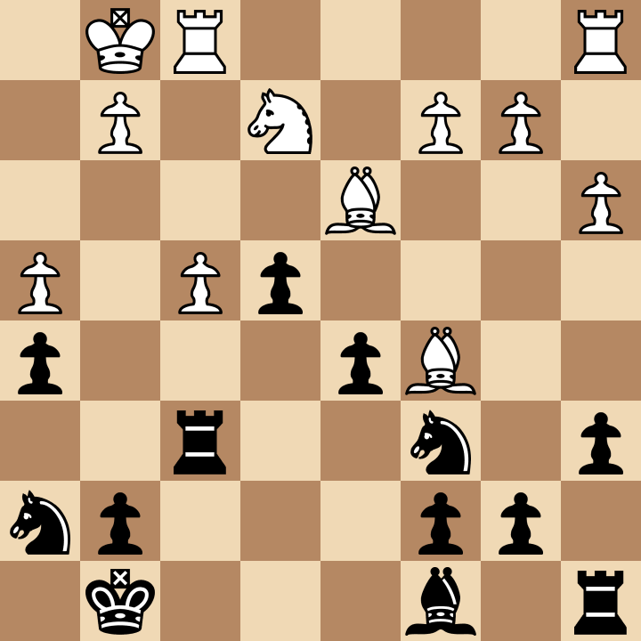
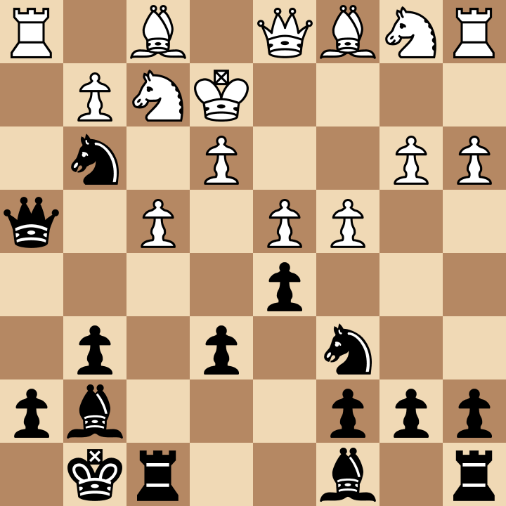
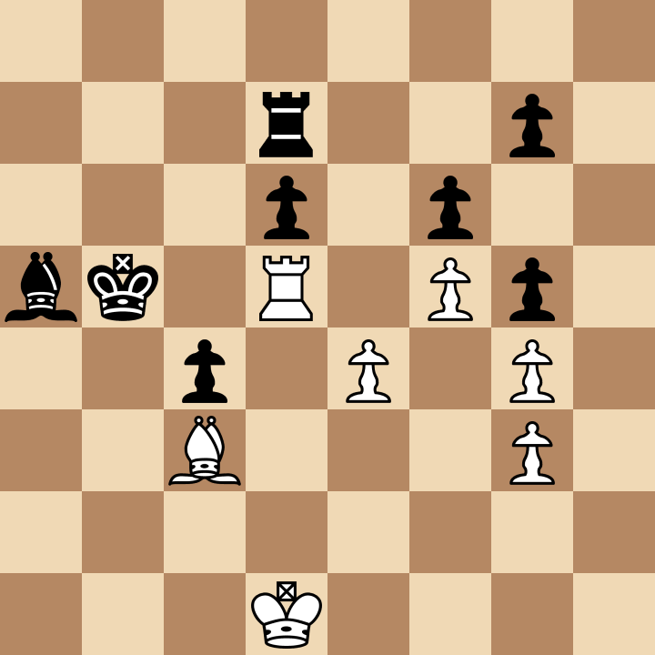

# Chess Tactic Classifier
A program that classifies chess tactics based on the concepts they demonstrate.

## Table of Contents
- Abstract
- Timeline
- Data sources
- Technologies
- Club resources
- End Goal

## Abstract
To improve their skills, many chess players practice simple chess puzzles of one or two moves. These puzzles can be grouped based on the different concepts or strategies they illustrate, and learning and recognizing these patterns is a key skill for competitive chess players. We are going to build a program that recognizes three types of tactics: forks, skewers and trapped pieces.

<table>
 <tr>
  <td>
   <h3>Trapped Piece</h3>
   
  </td>
  <td>
   <h3>Fork</h3>
    
  </td>
  <td>
   <h3>Skewer</h3>
   
  </td>
 </tr>
 </table>
 
## Timeline
### Week 3
- Plan web scraping process
- scrape data from Chess.com
- Get data into .csv files for each tactic type
#### Example:
- fork.csv
    - FEN, Qe3, d4, white
    - FEN, b6, Be4, black

### Week 4
- Clean data, data features
- Potential features
    - squares attacked by piece that moved
    - occupied squares
    - pieces on the same line/diagonal as the piece that moved
- Organize Github repo
- Establish git workflow

### Week 5
- Choose and extract features / Design models

### Week 6
- figured out how virtual environments work
    - save reqs with $ pip freeze > requirements.txt
    - use $ pip install -r requirements.txt
- Design models, UI design
-Adam: attacked piece is defended

### Week 7
- Design models, UI design
- 30 each: 1' 34" @ Starbucks
- 60, 30, 30: 2' 2" @ Starbucks
- 60 each: 3' 49" @ Starbucks, error in getting skewers

### Week 8
- Polishing project

### Week 9
- Buffer week

## Data sources
- Chess.com

## Technologies
- python for scraping data
- python for machine learning
- python (django) / js for webapp building

## Club resources required
- guidance on web scraping and building the webapp

## End Goal
A webapp that users can copy and paste a chess position (in the form of an FEN string) and see the position displayed, with the category of tactic the program outputs. 
